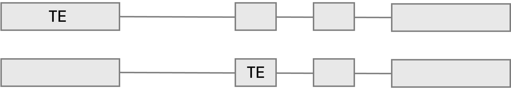

Ahora tengo tablas así:
~~~~~~~~~~~~~~~~~~~~~~~~

.. image:: _static/excel.png
   :alt: Descripción de la imagen
   :width: 6000px
   :align: center

Ahora lo que necesito que eliminar las entradas que representan únicamente un exon:

O sea me sirven cosas así:

Y Según David debería evitar cosas que se vean asi:

Entonces lo que necesito es eliminar las entradas que tengan un solo exon!
lo que hay que hacer es ir a la columna 2 y sacar esta lista:

